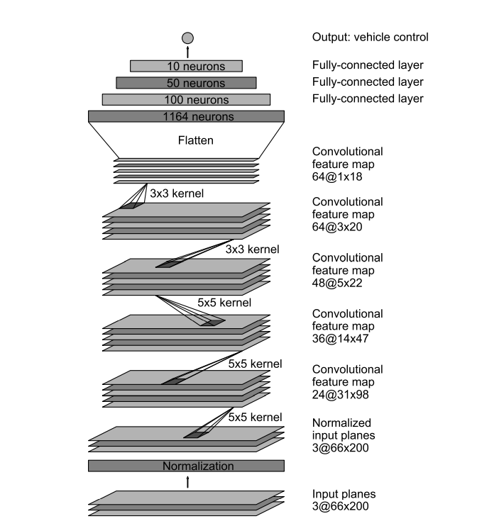
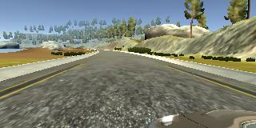
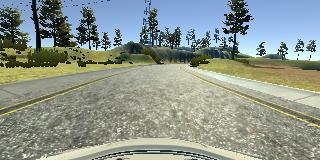
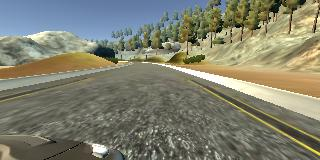
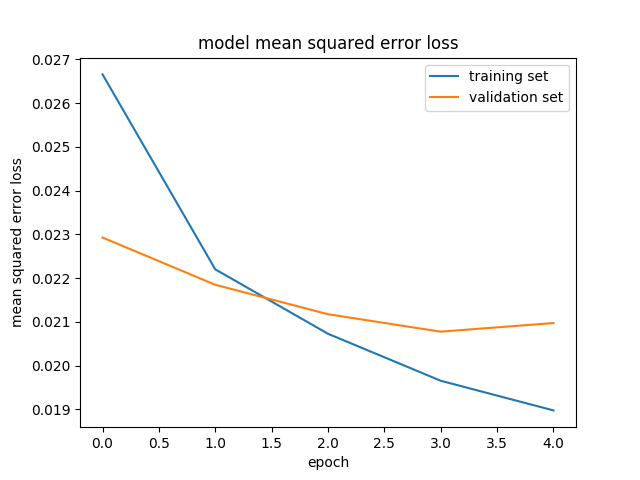

# **Behavioral Cloning** 

## Writeup by Sakshay Mahna

---

**Behavioral Cloning Project**

The goals / steps of this project are the following:
* Use the simulator to collect data of good driving behavior
* Build, a convolution neural network in Keras that predicts steering angles from images
* Train and validate the model with a training and validation set
* Test that the model successfully drives around track one without leaving the road
* Summarize the results with a written report


[//]: # (Image References)

[image1]: ./examples/placeholder.png "Model Visualization"
[image2]: ./examples/placeholder.png "Grayscaling"
[image3]: ./examples/placeholder_small.png "Recovery Image"
[image4]: ./examples/placeholder_small.png "Recovery Image"
[image5]: ./examples/placeholder_small.png "Recovery Image"
[image6]: ./examples/placeholder_small.png "Normal Image"
[image7]: ./examples/placeholder_small.png "Flipped Image"

---
### Files Submitted & Code Quality

#### 1. Submission includes all required files and can be used to run the simulator in autonomous mode

My project includes the following files:
* data.py containing the script to load the data
* model.py containing the script to create the model
* train.py containing the script to train the model
* drive.py for driving the car in autonomous mode
* model.h5 containing a trained convolution neural network 
* writeup.md summarizing the results
* video.mp4 containing the video of the car driving around for one lap.

#### 2. Submission includes functional code
Using the Udacity provided simulator and my drive.py file, the car can be driven autonomously around the track by executing 
```sh
python drive.py model.h5
```

#### 3. Submission code is usable and readable

The model.py file contains the code for the architecture of convolutional neural network.
The train.py file contains the code for training and saving the convolution neural network. The file shows the pipeline used for training and validating the model.
Both the files contain comments to explain how the code works.

### Model Architecture and Training Strategy

#### 1. An appropriate model architecture has been employed

The model starts with a Keras lambda layer to normalize the data (code line 20). There are two models that were tested, LeNet and Nvidia based models. The final model used is Nvidia based.

The model consists of a Convolutional Neural Network with 3 starting layers having 5x5 filters and depths 24, 36 and 48 respectively. The final 2 layers have 3x3 filters and both having depths 64. The convolutionals are followed by a Neural Network of depths 100, 50 and 10 (function on code line 59).

The model includes RELU layers to introduce nonlinearity. 

#### 2. Attempts to reduce overfitting in the model

The number of epochs were adjusted to reduce overfitting of the model.
The model was trained and validated on different data sets to ensure that the model was not overfitting (data.py function line 77). The model was tested by running it through the simulator and ensuring that the vehicle could stay on the track.

#### 3. Model parameter tuning

The model used an adam optimizer, so the learning rate was not tuned manually (train.py line 18).

#### 4. Appropriate training data

Training data was chosen to keep the vehicle driving on the road. A combination of center lane driving, recovering from the left and right sides of the road and driving slowly and accurately around curves was used. 

The details for the creation of the training data are provided in the further sections. 

### Model Architecture and Training Strategy

#### 1. Solution Design Approach

The overall strategy for deriving a model architecture was to try different changes and improving the architecture iteratively.

The first step was to use a LeNet convolutional neural network model. This was the simplest CNN model to start with and check the pitfalls and the various problems with the code.

The image and steering angle data was split into training and validation sets. It was found that the first model had relatively high mean squared error on the training set and validation set both, implying that the model was not powerful enough for the task.

The next step was to use a more powerful model, the one developed by Nvidia and mentioned in the course content [Link](https://images.nvidia.com/content/tegra/automotive/images/2016/solutions/pdf/end-to-end-dl-using-px.pdf). This gave a relatively better and almost equal training and validation set mean squared error. A number of adjustments were made to the number of epochs to avoid overfitting.

The final step was to run the simulator to see how well the car was driving around track one. There were a few spots where the vehicle fell off the track, particularly around sharp turns. To improve over these failures, some more data(car running on curved roads) was collected. The model was trained again on the complete data again.

At the end of the process, the vehicle is able to drive autonomously around the track without leaving the road.

#### 2. Final Model Architecture

The final model architecture (model.py function on line 59) consisted of a convolution neural network with the following layers and layer sizes:

| Layer         		|     Description	        					| 
|:---------------------:|:---------------------------------------------:| 
| Input         		| 160x320x3 Normalized image   			        | 
| Convolution 5x5     	| 2x2 stride, valid padding, depth 28	        |
| RELU					|												|
| Convolution 5x5     	| 2x2 stride, valid padding, depth 36	        |
| RELU					|												|
| Convolution 5x5     	| 2x2 stride, valid padding, depth 48	        |
| RELU					|												|
| Convolution 3x3     	| 1x1 stride, valid padding, depth 64	        |
| RELU					|												|
| Convolution 3x3     	| 1x1 stride, valid padding, depth 64	        |
| RELU					|												|
| Fully connected		| depth 100       					            |
| RELU					|												|
| Fully connected		| depth 50       					            |
| RELU					|												|
| Fully connected		| depth 10       					            |
| RELU					|												|
| Fully connected		| depth 1       					            |

Here is a visualization of the architecture

<p align="middle">
    
</p>

*Image taken from the Nvidia Paper*

#### 3. Creation of the Training Set & Training Process

To capture good driving behavior, the following process was followed:

1. Driving around the map for two laps
2. Driving around the map in reverse direction for two laps
3. Making recovery moves for one lap, particularly for the curves
4. Driving around curves and keeping in center for one lap

In addition to this, for data augmentation the following process was followed:

1. Flipping images
2. Using left and right images with correction
3. Applying the flip mechanism to the left and right images as well

After the collection process, there were 50,457 images. These images are further preprocessed before inputing to the network by normalization and cropping the relevant area of the image.

These images were randomly shuffled and put 20% of the data was used as validation set. 

The validation step helped determing if the model was overfitting or underfitting. 

The ideal number of epochs were 5. As the validation loss was still taking significantly lower values with epochs less than 5, therefore epochs greater than or equal to 5 are required. Also, increasing the number of epochs was still reducing the validation error however, the training error also starting reducing significantly after 5 epochs resulting in overfitting. Hence 5 was taken as the optimal epochs.

Adam Optimizer was used for training so manual adjustment of learning rate was not necessary.

<p align="middle">
    
    
    
</p>

*Some training images*

<p align="middle">
    
</p>

*Visualization of Training and Validation Loss*
